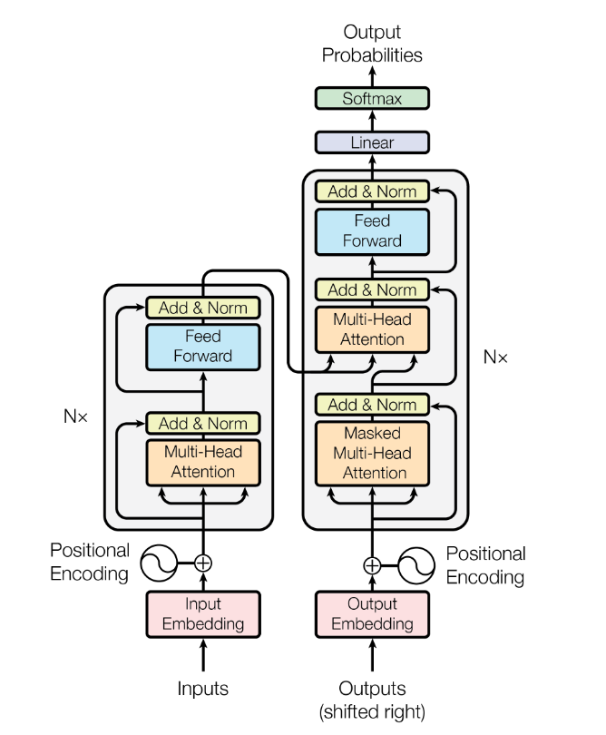
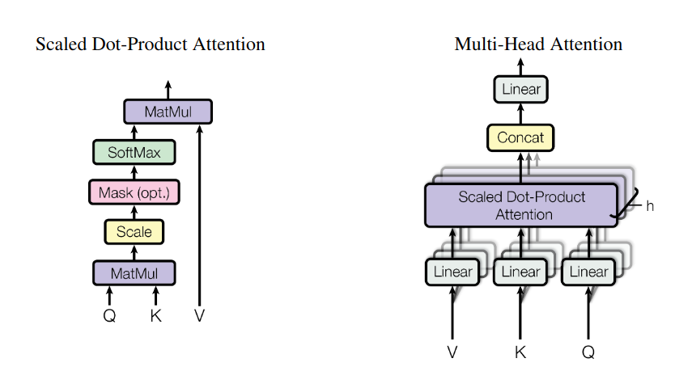
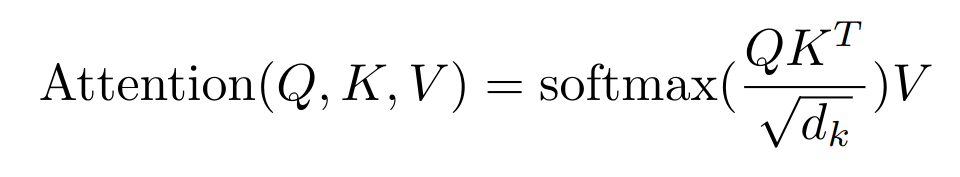

## Attention Is All You Need

"Attention Is All You Need (https://arxiv.org/pdf/1706.03762)" is the most influential paper forming the backbone of all Large Language Models (LLMs) we see today. 

### Limitations of RNN and LSTM Architectures
- **Serial Nature**: RNN and LSTM architectures are inherently serial, which does not fully utilize the parallel nature of GPUs.
- **Long-Term Dependencies**: These architectures fail to capture long-term dependencies and suffer from the vanishing gradient problem.

### Advantages of Transformer Architecture
- **Parallel Processing**: Transformer architecture is highly parallel.
- **Long-Term Dependencies**: Captures long-term dependencies through multi-head attention.
- **Vanishing Gradient Problem**: Does not suffer from the vanishing gradient problem.

### Structure of Transformer Architecture
- **Encoder and Decoder**: The transformer architecture consists of an encoder and a decoder. The encoder part encodes the input data and passes it to the decoder part.

### Key Features
- **Multi-Head Attention**: 
  - The encoder part consists of multiple self-attention heads (the paper uses 8).
  - The decoder part uses self-attention and cross-attention to get attention scores with input features. Cross-attention helps determine which input sequence is responsible for generating the given output.
- **Layer Normalization**: Smoothens the objective function and helps in the smooth flow of gradients.
- **Positional Encoding**: 
  - A trigonometric function (sine and cosine) added to embeddings.
  - Non-trainable and used because the transformer architecture is positionally invariant.
  - Helps the architecture understand the order of the input sequence.

